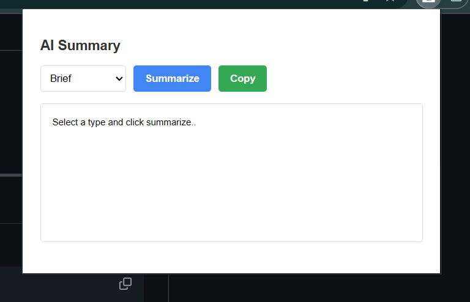
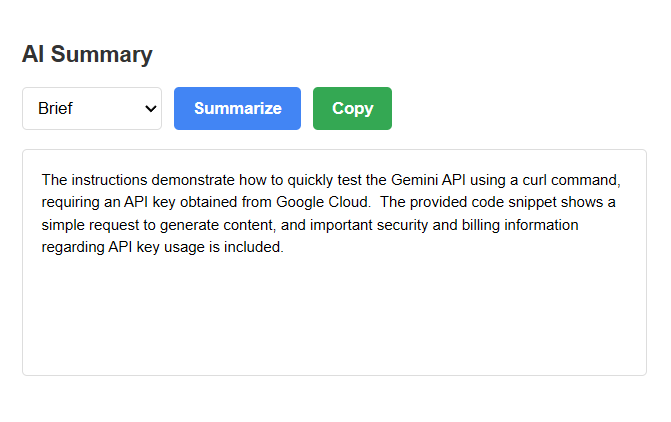

# 🧠 Summarizer Chrome Extension

A lightweight, easy-to-use Chrome extension that summarizes web page content in real-time—perfect for quickly grasping key points without scrolling through long articles.

---

## 🚀 Features

- **Instant AI-powered summarization**: Highlight or open any webpage, click the extension icon, and get a concise summary of the content.
- **Clean & intuitive UI**: Simple popup interface built with HTML/CSS/JavaScript for seamless user interaction.
- **Background ↔ Content communication**: Built using Chrome Extensions API (Manifest V3), showcasing inter-script messaging.
- **Built for learning**: Crafted to explore how Chrome extensions work—especially Manifest V3, content scripts, messaging patterns.

---

## 🧩 Tech Stack

- **Frontend**: HTML, CSS, JavaScript
- **Chrome Extensions API**: content scripts, background scripts, popup UI, Manifest V3
- **AI summarization logic**: Can plug into any LLM or summarization backend

---

## 🛠️ What You’ll Learn

- Setting up a Chrome extension manifest and project structure  
- Deploying **Manifest V3** for background and content scripts  
- Injecting scripts into web pages and capturing DOM data  
- Communicating between popup → background → content scripts  
- Packaging, testing, and loading extensions locally

---

## 📷 ScreenShots




---

## 🧭 Getting Started

1. **Clone the repo**  
   ```bash
   git clone https://github.com/Mansi-Narang/Summarizer_Extension.git
   cd Summarizer_Extension
   ```

2. **Load in Chrome**  
   - Go to `chrome://extensions/`  
   - Enable **Developer mode**  
   - Click **Load unpacked**, then select the project folder

3. **Try it out**  
   - Open any web page  
   - Click the extension icon to generate a summary  

---

## 🔭 What's Next?

- 🔧 **Connect to a real summarization API** (e.g., OpenAI, Hugging Face)
- 🎨 **Improve UI/UX**—add loading spinners, styles, or themes
- 🔐 **Add settings** (e.g., summary length, tone)
- 📦 **Publish on Chrome Web Store**

---

## 🤝 Contribute

Contributions are welcome! Feel free to:
- Open **issues** for bugs or feature ideas  
- Submit **PRs** with improvements  
- Suggest better summarization models or UI designs

---

## 📜 License

Licensed under the **MIT License** – see the [LICENSE](LICENSE) file for details.

---

## 🙏 Acknowledgements

Inspired by open-source summarizer extensions like [knowsuchagency/summarizer].

---

**Mansi Narang**  
Aspiring full-stack developer and Chrome extensions enthusiast  
[LinkedIn](https://www.linkedin.com/in/mansi-narang-4a802228a/) • [Portfolio](https://github.com/Mansi-Narang)
